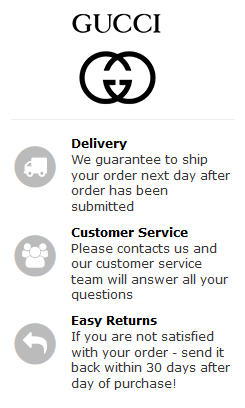
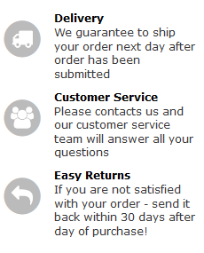
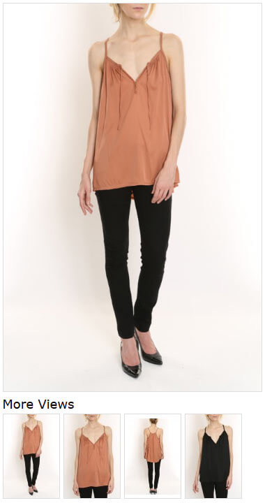
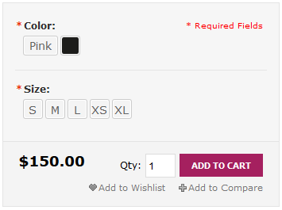
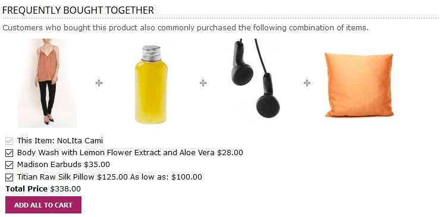
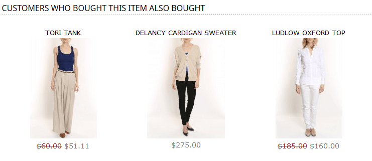

# Argento Pure 2.0 Product Page

### Layout

Pure 2.0 is using `page_two_columns_right` layout for the product page. To
change it to another one, create [custom.xml][custom_xml] file and add the
following instruction:

```xml
<catalog_product_view>
    <update handle="page_two_columns_left"/>
</catalog_product_view>
```

Possible values for handle variable:

```
page_two_columns_left
page_two_columns_right
page_three_columns
page_one_column
```

### Sidebar

#### Brand information

{::options parse_block_html="true" /}
<div class="mdl-grid"><div class="mdl-cell mdl-cell--3-col mdl-cell--2-col-tablet mdl-cell--1-col-phone">



</div><div class="mdl-cell mdl-cell--9-col mdl-cell--6-col-tablet mdl-cell--3-col-phone">

Brand information block is powered by AttributePages module and displays
image linked with product `manufacturer` attribute.

To make this block active, you should create Attributepage for the `manufacturer`
attribute at `Templates-Master > Attribute Pages > Manage Pages` and upload
images for every attribute option.

You can edit this block at `Cms > Static Blocks`. See the `product_sidebar`
block contents:

```
{{block type="attributepages/product_option" template="tm/attributepages/product/options.phtml" width="180" height="90" use_image="1" image_type="image" use_link="1" attribute_code="manufacturer" css_class="hidden-label"}}
```

You can also create attribute page for any other attribute. In this case you
will need to change part of the widget code above:

Replace `attribute_code="manufacturer"` with `attribute_code="attribute_code"`

</div></div>

#### Services sidebar

{::options parse_block_html="true" /}
<div class="mdl-grid"><div class="mdl-cell mdl-cell--3-col mdl-cell--2-col-tablet mdl-cell--1-col-phone">



</div><div class="mdl-cell mdl-cell--9-col mdl-cell--6-col-tablet mdl-cell--3-col-phone">

Services sidebar block is a simple cms block powered with FontAwesome icons.

You can edit this block at `Cms > Static Blocks`.

See the `services_sidebar` block contents. You can use any icon from [FontAwesome set][fontawesome]

Here is the sample of how the delivery icon is coded:

```html
<span class="fa-stack fa-2x icons-primary">
    <i class="fa fa-circle fa-stack-2x"></i>
    <i class="fa fa-truck fa-stack-1x fa-inverse"></i>
</span>
```

</div></div>

### Content

#### Images

{::options parse_block_html="true" /}
<div class="mdl-grid"><div class="mdl-cell mdl-cell--3-col mdl-cell--2-col-tablet mdl-cell--1-col-phone">



</div><div class="mdl-cell mdl-cell--9-col mdl-cell--6-col-tablet mdl-cell--3-col-phone">

Product image and gallery is powered by LightboxPro module, that has a lot of
configuration optins at `System > Configuration > Template-Master > LightboxPro`
section.

It allow you to configure the following options:

- Image dimensions
- Gallery controls
- Overlay settings
- Popup settings

</div></div>

#### Colorswatches

{::options parse_block_html="true" /}
<div class="mdl-grid"><div class="mdl-cell mdl-cell--3-col mdl-cell--2-col-tablet mdl-cell--1-col-phone">



</div><div class="mdl-cell mdl-cell--9-col mdl-cell--6-col-tablet mdl-cell--3-col-phone">

Catalog Configurable Swatches - is a standard Magento feature since 1.9.1, which
is fully integrated with the following Argento modules:

- AjaxPro
- AjaxSearch
- LightboxPro

You can read this
[great tutorial](colorswatches) by [sherodesigns](http://sherodesigns.com) about
color swatches configuration.

</div></div>

#### Tabs


Argento tabs is powered by EasyTabs module. You can add or remove additional tabs
from `Templates-Master > Easy Tabs` page.

The following tabs are shown by default:

- Product Description
- Additional Information
- Tags
- Reviews
- Questions

All of these tabs are standard Magento features except `Questions`. It's a AskIt
powered block.

This block is very handy for customers that are not sure about the product or
sevices and have some questions to ask.

#### Soldtogether blocks

Soldtogether powered blocks. You can customize these blocks
from  `System > Configuration > Tempaltes-Master > SoldTogether` section.

Configuration provides the following options:

- Products count
- Columns count
- Amazon style for `Frequently bought together` block

##### Frequently bought together

`System > Configuration > Tempaltes-Master > SoldTogether > Frequently Bought Together`



##### Customers who bought this item also bought

`System > Configuration > Tempaltes-Master > SoldTogether > Customer Bought Together`



[custom_xml]: /argento/theme-customization/small-changes/#custom-layout-update-file "custom.xml layout"
[fontawesome]: http://fontawesome.io/icons/ "FontAwesome Icons"
[colorswatches]: http://sherodesigns.com/tutorial-configurable-swatches-in-magento/ "Catalog Configurable Swatches tutorial"
